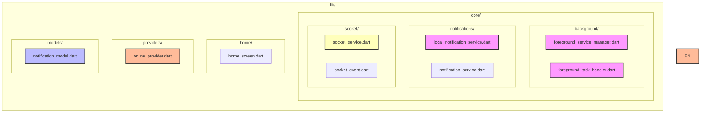

# Refactor Visual Overview

Below is a high‑level diagram of the proposed folder structure and how the main layers map to SOLID principles.

* **Single Responsibility** – each file encapsulates one cohesive responsibility.
* **Open/Closed** – providers and services expose interfaces (`ISocketService`) that can be extended without modification.
* **Liskov Substitution** – `SocketService` implements `ISocketService`.
* **Interface Segregation** – small focused interfaces (`ISocketService`).
* **Dependency Inversion** – high‑level modules (`Online` provider) depend on abstractions rather than concrete implementations.

You can view the diagram directly in this markdown or open the file in any markdown viewer that supports Mermaid.
